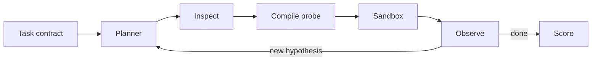

# Arc

A dynamic evaluation harness for AI agents. Arc inspects a target, runs typed probes against a task contract, and chooses the next probe from what it just observed. Probe kinds are a closed catalog. The sequence is not.



## How it works

You pass a target (repo, API, or agent) and a **task contract**. The contract is the oracle. Scores come from the spec, never from the agent's own code.

Each episode:

1. Inspect the target (filesystem, AST, OpenAPI). Inspection is deterministic. The planner only labels what was found.
2. Open a **hypothesis**: a claim about a behavior or a bug.
3. Pick a `ProbeSpec` from the catalog. A compiler emits `node:test` or pytest.
4. Execute only through capabilities: `inspectRepo`, `inspectApi`, `mockNetwork`, `runProbe`, `traceExecution`, `checkInvariant`, `score`.
5. Read a structured observation. Confirm, reject, or open another hypothesis.
6. Stop when hypotheses are quiet or the probe, time, or cost budget is hit. Print the score and what was left untested.

The planner cannot write freeform tests. Anything that is not a `ProbeSpec` is refused. Every capability call is logged.

A frozen test suite does not change if the agent adds retries. An LLM that dumps pytest once is also frozen after that dump. Arc is different: a later probe can exist only because an earlier observation opened a hypothesis.

**Caching example.** Inspect finds a cache and a `fetch` wrapper, so Arc probes that a second identical GET skips the network. It also sees `retry`, so it mocks `fail` then `ok` and checks two HTTP calls with one cache write. If that holds, it probes idempotency. A cache-key collision can show up here even though that probe did not exist at the start.

## CLI

```bash
pnpm install
pnpm test
pnpm evaluate -- targets/cache --task "implement caching"
```

Or:

```bash
pnpm exec tsx src/cli/index.ts evaluate targets/cache --task "implement caching"
```

```
Task: Implement caching

Generated:  behavioral probes, network mock, concurrency scenario
Result:     8/10 probes passed
Discovered: cache key collision; in-flight duplicate work
Untested:   listed on the scorecard
Score:      72/100
```

Set `OPENAI_API_KEY` to let the planner pick the next `ProbeSpec` (still catalog-only). Without a key, a deterministic search is used. `ARC_SANDBOX=docker` runs probes in `node:22-alpine` with network off.

CLI-first. No web UI in the first release.

## Layout

```
src/domain        Task, Hypothesis, ProbeSpec, Observation, Score, ports
src/application   plan episode, run probe, update hypotheses, score
src/adapters      python, node, docker sandbox, inspect, planner LLM
src/probes        catalog and compilers
src/cli           arc evaluate
targets/cache     fixture target (caching HTTP client)
```

## Stack

- **Core:** TypeScript, hexagonal ports
- **Planner:** official OpenAI SDK; selects `ProbeSpec` from the catalog only
- **Sandbox:** Docker per episode; network off unless the mock proxy is injected
- **Node:** `node:test` and undici MockAgent
- **Python:** pytest and httpx/`respx`, same `ProbeSpec`
- **Inspect:** TypeScript AST (`typescript` compiler API); OpenAPI when present

## Locks

- The task contract is the oracle.
- The planner calls capabilities. It does not write unconstrained tests.
- Probe kinds stay a closed catalog. Observations open hypotheses, not new capabilities.
- Execution that is not a `ProbeSpec` is refused.
